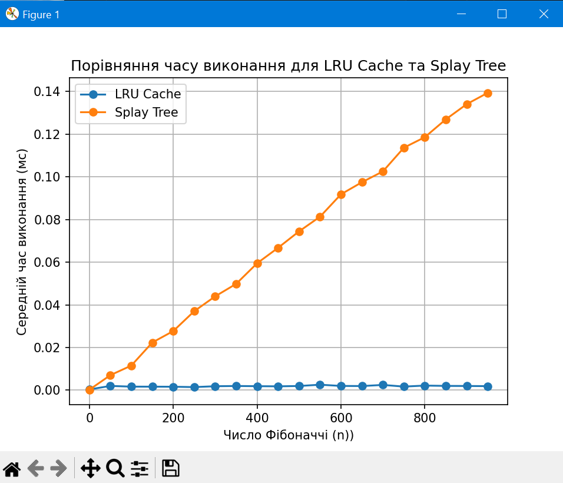

# Порівняння ефектисності розрахунку чисел Фібоначчі з використанням декратора Lru cache і Splay Tree

| n   | LRU Cache Time (ms) | Splay Tree Time (ms) |
| --- | ------------------- | -------------------- |
| 0   | 0.00034             | 0.00022              |
| 50  | 0.00199             | 0.00703              |
| 100 | 0.00166             | 0.01154              |
| 150 | 0.00164             | 0.02234              |
| 200 | 0.00161             | 0.02771              |
| 250 | 0.00144             | 0.03703              |
| 300 | 0.00185             | 0.04399              |
| 350 | 0.00196             | 0.04984              |
| 400 | 0.00187             | 0.05950              |
| 450 | 0.00180             | 0.06675              |
| 500 | 0.00196             | 0.07445              |
| 550 | 0.00256             | 0.08132              |
| 600 | 0.00199             | 0.09184              |
| 650 | 0.00193             | 0.09750              |
| 700 | 0.00246             | 0.10257              |
| 750 | 0.00168             | 0.11368              |
| 800 | 0.00215             | 0.11862              |
| 850 | 0.00200             | 0.12697              |
| 900 | 0.00196             | 0.13412              |
| 950 | 0.00189             | 0.13941              |

Заміри показують, що для всіх значень n, LRU Cache перевершує Splay Tree за швидкістю виконання.

Наприклад, для n = 950:

LRU Cache Time: 0.00189 ms.

Splay Tree Time: 0.13941 ms.

Різниця у швидкості становить приблизно 73 разb.

Це зумовлено додатковими витратами на балансування дерева під час операцій вставки та пошуку. Хоча Splay Tree оптимізує доступ до часто використовуваних елементів, у цьому випадку це не дає значної переваги. Амортизована складність доступу становить O(log n).

Натомість @lru_cache миттєво повертає збережений результат, оскільки використовує хеш-таблицю (мапу) з доступом до елементів за O(1).
